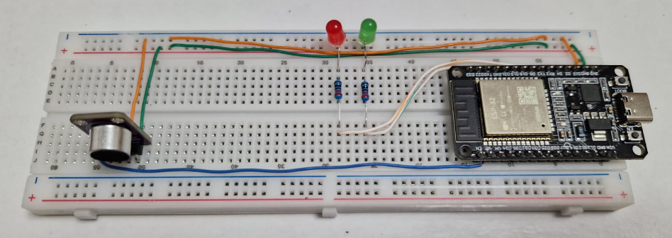

# IoT-Noise-Monitor
Portable IoT system for environmental noise monitoring and diagnosis. 2nd-year Applied Informatics university project.

## Project Details
**Context:** 2nd-year "Applied Informatics" university project at Universitatea Transilvania din Brașov (UNITBV).

**Purpose & Objectives:** Developed a robust, user-controlled IoT diagnostic tool bridging edge hardware with cloud analytics. The system allows the user to manually trigger the recording of environmental noise over custom time intervals using a physical push-button. 

**System Workflow & Key Features:**
* **Real-Time Edge Processing:** The microcontroller constantly evaluates the audio input against predefined thresholds, providing immediate visual feedback via LEDs (Green for safe parameters, Red for threshold breach).
* **On-Demand Logging:** Data collection is entirely state-driven, starting and stopping cleanly via hardware button interrupts/states.
* **Cloud Telemetry & Statistics:** While recording, the system transmits the telemetry data via Wi-Fi to a Cloud platform. The cloud layer is responsible for aggregating the data and calculating key session metrics (Maximum, Minimum, and Average noise levels).

**Technologies Used:**
* **Hardware:** ESP32 Microcontroller (Wi-Fi enabled), Sound Sensor MAX4466, LEDs, Breadboard.
* **Software & Logic:** C++, Arduino IDE, Event-driven programming.
* **Architecture:** Edge computing (local alerts) combined with Cloud data processing.
